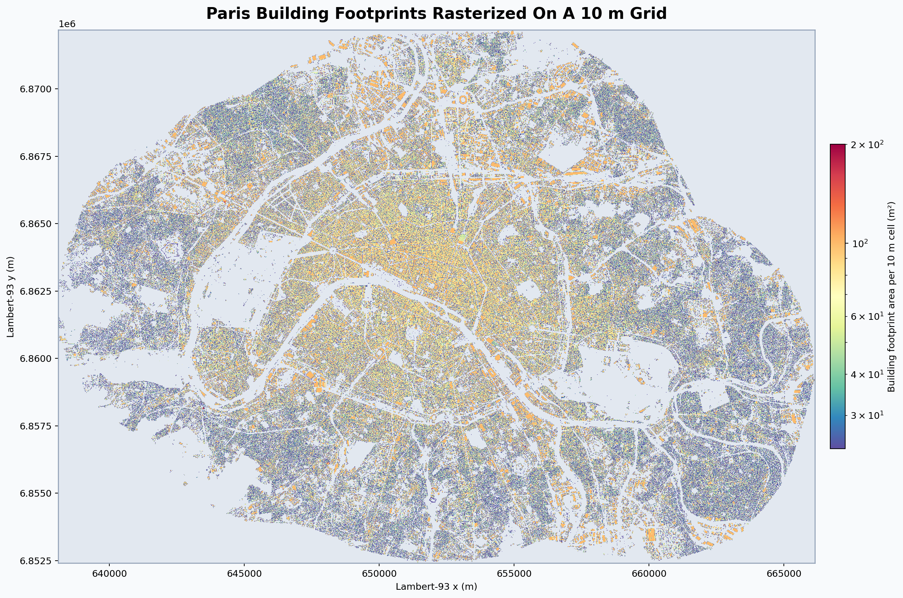
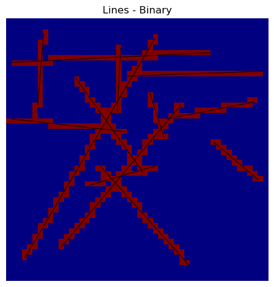
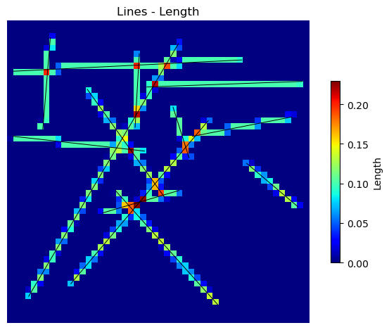
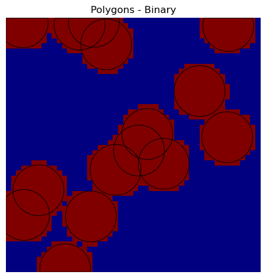
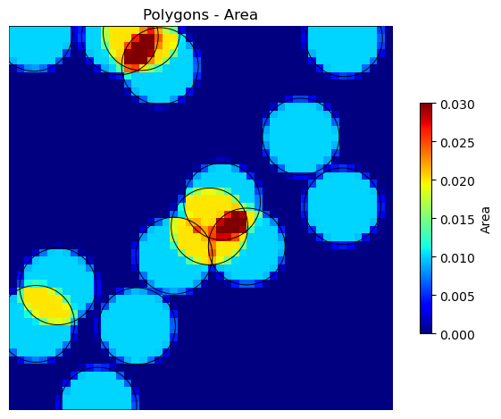

# Rasterizer

`rasterizer` is a lightweight Python package that speeds up rasterization of `geopandas` GeoDataFrames by specializing in regular, axis-aligned rectangular grids.

## Features

- Rasterize lines into a binary (presence/absence) or length-based grid.
- Rasterize polygons into a binary (presence/absence) or area-based grid.
- Fast because it targets regular rectilinear grids described by 1D `x` and `y` cell-center coordinates with constant spacing.
- Hybrid polygon rasterization for large polygon bounding boxes: exact clipping on boundary cells, faster scanline filling for interior cells.
- Weighted rasterization: Rasterize geometries while weighting the output by a numerical column in the GeoDataFrame.
- Works with `geopandas` GeoDataFrames.
- Outputs an `xarray.DataArray` for easy integration with other scientific Python libraries.
- No GDAL dependency for the rasterization algorithm itself.

For detailed usage and API documentation, please see the [full documentation](https://rasterizer.readthedocs.io).

## Usage

Here are some examples of what you can do with `rasterizer`.

```python
import geopandas as gpd
from rasterizer import rasterize_polygons

polys = gpd.read_file("polygons.gpkg")
area_raster = rasterize_polygons(polys, your_x_grid, your_y_grid, polys.crs, mode="area")

# Enable a tqdm progress bar when processing large geometry collections.
area_raster = rasterize_polygons(
    polys,
    your_x_grid,
    your_y_grid,
    polys.crs,
    mode="area",
    progress_bar=True,
)
```

### Large Dataset Showcase

This real-world example uses 606,667 building polygons on a 10 m Lambert-93 grid covering Paris. The `area` rasterization step completes in 13.1 s on a regular laptop used as the local documentation machine for a `2804 x 1978` grid.

```python
import geopandas as gpd
import numpy as np
from rasterizer import rasterize_polygons

buildings = gpd.read_file(
    "BDT_3-5_GPKG_LAMB93_D075-ED2026-03-15.gpkg",
    layer="batiment",
    columns=[],
)

xmin, ymin, xmax, ymax = buildings.total_bounds
x = np.arange(xmin, xmax, 10.0)
y = np.arange(ymin, ymax, 10.0)

coverage = rasterize_polygons(buildings, x=x, y=y, crs=buildings.crs, mode="area")
```



The full walkthrough, including the benchmark context and reproduction script, is available in the [large dataset showcase documentation](https://rasterizer.readthedocs.io/en/latest/large_dataset_showcase.html).

### Rasterizing Lines

You can rasterize lines in either binary or length mode.

| Binary Mode                                      | Length Mode                                      |
| ------------------------------------------------ | ------------------------------------------------ |
|  |  |

### Rasterizing Polygons

You can rasterize polygons in either binary or area mode.

For polygon workloads, `rasterizer` now uses two internal strategies. Small polygon bounding boxes are handled with exact per-cell clipping. Larger ones switch to a hybrid path that still clips boundary cells exactly, but fills interior spans with a scanline pass to reduce the amount of geometric clipping required. The resulting area and binary outputs stay exact at cell boundaries while scaling better on large polygons.

| Binary Mode                                            | Area Mode                                          |
| ------------------------------------------------------ | -------------------------------------------------- |
|  |  |

## Installation

You can install the package directly from PyPI:

```bash
pip install rasterizer
```

## Why rasterizer

This package provides functionalities that are not present in `rasterio.features`, such as area and length-based rasterization. It is also lighter and faster than using more general GDAL-based solutions because it is specialized for regular rectilinear grids instead of arbitrary raster layouts. GDAL's rasterization only burns values per pixel; it cannot return exact fractional area or length contributions without an expensive workaround. The common workaround is to rasterize at a much finer resolution and then downsample with averaging, which approximates the true area/length but is not exact and can be slow, e.g.:

```bash
gdal_rasterize -burn 1 -tr 1 1 -ot Float32 -of GTiff input.gpkg tmp_fine.tif
gdalwarp -tr 10 10 -r average tmp_fine.tif out_area_approx.tif
```

Doing this purely in `geopandas` by generating one polygon per grid cell and overlaying it with the input geometry is also slow because it creates a huge number of tiny geometries, triggers expensive overlay operations, and scales poorly with grid size.

That speed-up comes with a deliberate constraint: `rasterizer` is built for regular, axis-aligned rectangular grids, not for arbitrary affine transforms or irregular meshes.
