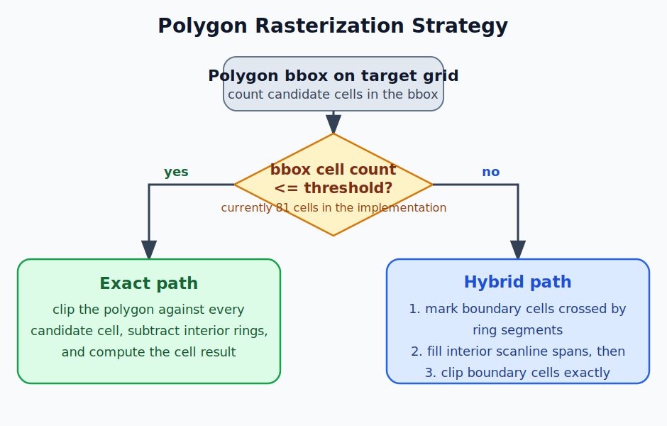
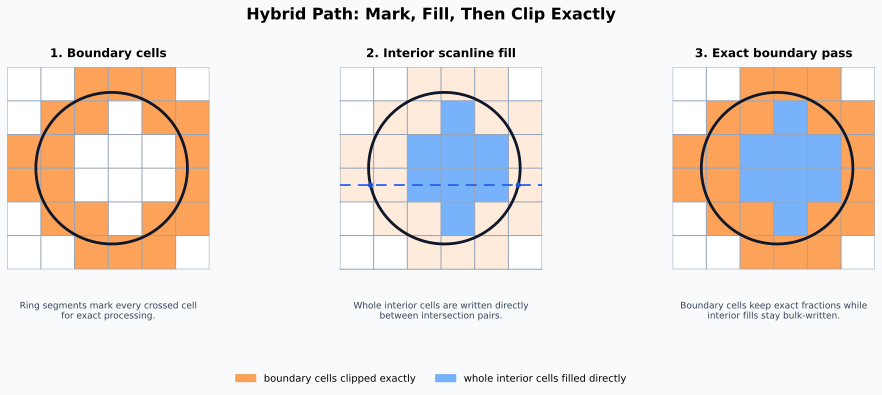
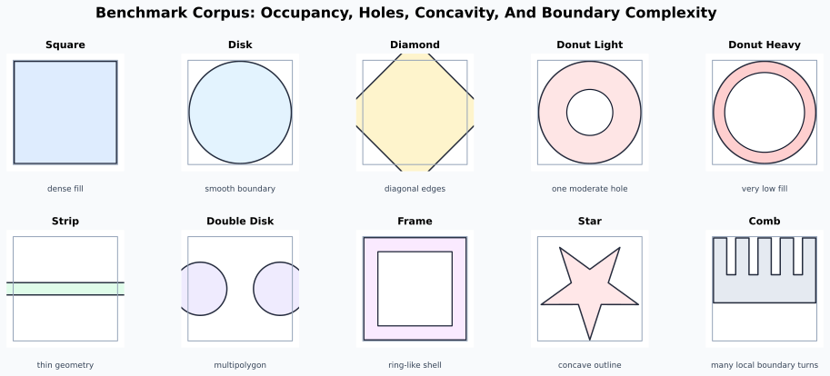
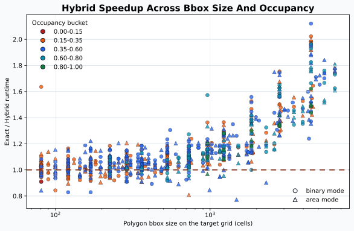
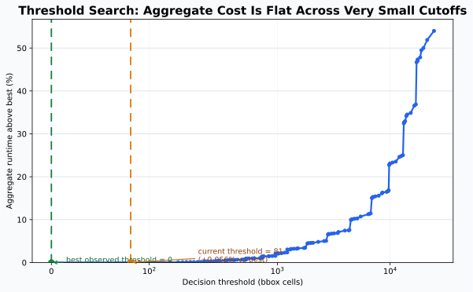

Algorithm Notes
===============

This page summarizes the polygon rasterization strategy used by ``rasterizer``.

Overview
--------

Polygon rasterization has two competing costs:

- exact per-cell clipping is straightforward and robust, but it becomes expensive when a polygon covers a large bounding box on the target grid
- bulk filling is much faster for polygon interiors, but it still needs exact handling near the polygon boundary

``rasterizer`` therefore uses two internal paths for polygons:

- small polygon bounding boxes use an exact engine that clips the polygon against every candidate cell
- larger polygon bounding boxes use a hybrid engine that clips only boundary cells exactly and fills the interior with scanline spans

The switch happens from an internal bbox-size threshold measured in grid cells. In the current implementation, that threshold is ``81`` cells.

   The engine chooses between simple exact clipping and a faster hybrid path based on the polygon bounding-box size on the target grid.

Exact Path
----------

For small polygon bounding boxes, the engine iterates over candidate cells and:

- clips the polygon exterior to the cell box
- subtracts clipped interior rings when holes are present
- computes the resulting area in ``mode="area"``, or marks the cell in ``mode="binary"``

This path minimizes algorithmic complexity and is a good fit when the number of candidate cells stays modest.

Hybrid Path For Large Polygons
------------------------------

For larger polygon bounding boxes, the engine separates the work into three stages.

   Large polygons avoid repeated clipping on fully interior cells. This illustration is generated from a Python plotting script that applies the same boundary-marking and scanline rules as the hybrid path.

1. Boundary detection

Each exterior and interior ring segment is tested against overlapping cells in the polygon bounding box. Any cell crossed by the polygon boundary is marked for exact processing later.

2. Interior fill

For each scanline of cell centers, the engine computes ring intersections, sorts them, and fills the spans between intersection pairs. Cells that are not marked as boundary cells can be written directly:

- in ``mode="binary"``, filled cells become ``True``
- in ``mode="area"``, filled cells receive the full cell area, scaled by the polygon weight when a weight column is used

3. Exact boundary pass

Cells touched by the polygon boundary are then processed with the same exact clipping routine used by the small-polygon path. This preserves exact cell fractions where the geometry actually cuts through a cell.

Why This Helps
--------------

The expensive part of exact polygon rasterization is repeated clipping against many fully interior cells that all have the same answer. The hybrid strategy avoids that repeated work:

- interior cells are filled in bulk from scanline spans
- only boundary cells pay the cost of polygon clipping
- holes are handled naturally because their rings participate in both boundary marking and scanline intersections

In practice, this keeps the simple exact behavior for small cases and reduces clipping work substantially for large polygons.

Benchmark-Driven Threshold Tuning
---------------------------------

The switch threshold was not chosen heuristically. It was tuned by forcing both engines on the same synthetic corpus and comparing their measured runtimes.

Benchmark process
^^^^^^^^^^^^^^^^^

The local benchmark used during tuning forces the polygon engine into one path or the other by setting the internal threshold to extremes:

- ``10**9`` forces the exact per-cell clipping path
- ``0`` forces the hybrid path for every polygon bbox

Each sampled case is then rasterized twice, once with each forced path, on the same grid and in the same mode. The checked-in benchmark dataset in ``docs/_static/polygon_threshold_benchmark.csv`` contains ``1020`` measured cases. It was generated from a local benchmark harness that is intentionally kept outside version control.

The corpus varies several factors that matter for the crossover:

- bbox size on the target grid, from a few dozen cells to well into the tens of thousands
- occupancy ratio, measured as ``polygon_area / discrete_bbox_area``
- boundary complexity, including smooth shapes, diagonal edges, concave outlines, thin strips, comb-like geometries, and polygons with holes
- topology, including both single polygons and multipolygons
- grid alignment, by applying several sub-cell translations and small rotations
- rasterization mode, in both ``mode="binary"`` and ``mode="area"``

   Representative shape families used in the benchmark corpus. The goal was to span occupancy, topology, and boundary complexity rather than optimize for one easy polygon class.

Why Occupancy Matters
^^^^^^^^^^^^^^^^^^^^^

Occupancy changes the balance between the two engines:

- the exact path pays roughly for every candidate cell in the polygon bbox
- the hybrid path pays more for boundary cells, scanline crossings, and ring complexity, but it avoids re-clipping large fully interior regions

That means two polygons with the same bbox size can have different crossovers if one is dense and the other is mostly empty space or holes.

   Each point is one measured case. Values above ``1`` mean the hybrid path was faster. Hybrid speedups grow with bbox size, but low-occupancy and hole-heavy polygons were also sampled explicitly so the switch was not tuned only for dense shapes.

Selecting The Cutoff
^^^^^^^^^^^^^^^^^^^^

For every candidate threshold, the benchmark computes the aggregate runtime obtained by choosing:

- the exact path when ``bbox_cells <= threshold``
- the hybrid path otherwise

The resulting curve is shallow near the optimum: several very small thresholds perform almost the same. In the current benchmark snapshot, the best observed aggregate time lands at the lowest tested cutoff, but ``81`` cells stays within about ``0.06%`` of that best total while still reserving the exact path for genuinely tiny polygon bboxes.

   Aggregate runtime relative to the best observed threshold on the sampled corpus. The important result is not a sharp single optimum, but that the old large cutoff was clearly too high and that the useful regime sits among very small bbox thresholds.

In other words, the benchmark supports a policy more than a magic number: keep the exact path only for very small polygon bboxes, and switch to hybrid early.
