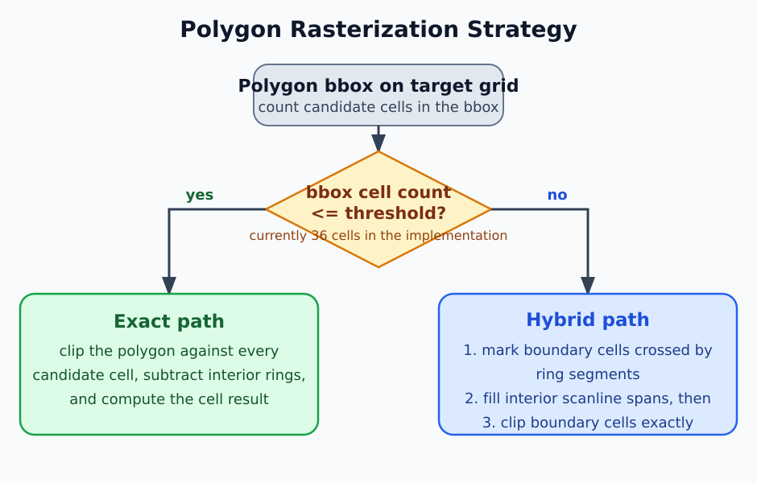
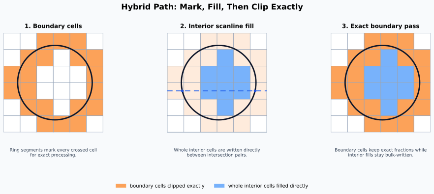
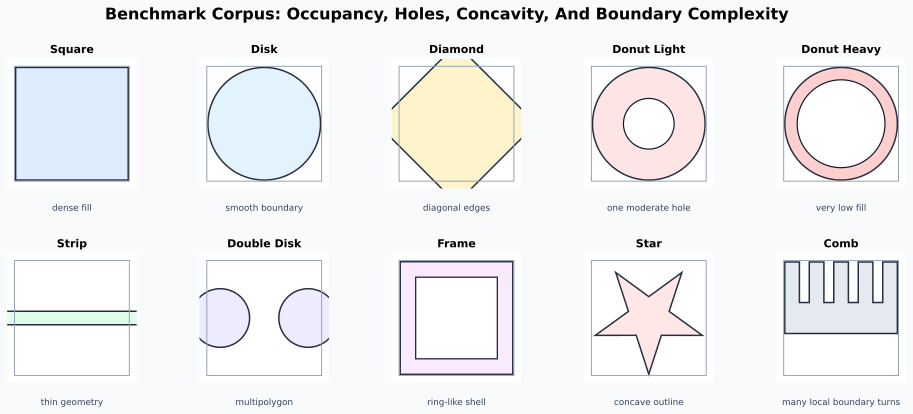
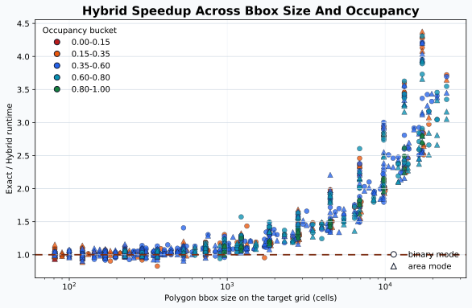
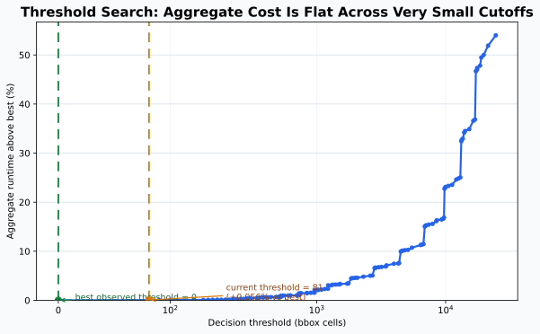

Algorithm Notes
===============

This page summarizes the polygon rasterization strategy used by ``rasterizer``.
The speed-ups described here rely on the package specializing in regular rectilinear grids with constant cell
spacing.

Overview
--------

Polygon rasterization has two competing costs:

- exact per-cell clipping is straightforward and robust, but it becomes expensive when a polygon covers a large bounding box on the target grid
- bulk filling is much faster for polygon interiors, but it still needs exact handling near the polygon boundary

Because the target grid is regular and axis-aligned, ``rasterizer`` can turn that structure into simpler index
math and cheaper traversal than a general rasterization engine can usually assume.

``rasterizer`` therefore uses two default paths for polygons:

- small polygon bounding boxes use an exact engine that clips the polygon against every candidate cell
- larger polygon bounding boxes use a signed per-edge area accumulation engine that visits only the cells crossed by polygon edges and fills the interior with a row sweep

The switch happens from an internal bbox-size threshold measured in grid cells. In the current implementation, that threshold is ``36`` cells. A third engine, the earlier hybrid boundary-clipping path, is retained as an internal fallback (see below) but is not selected by default.

   The engine chooses between simple exact clipping and the accumulation path based on the polygon bounding-box size on the target grid.

Exact Path
----------

For small polygon bounding boxes, the engine iterates over candidate cells and:

- clips the polygon exterior to the cell box
- subtracts clipped interior rings when holes are present (rings whose bounding box does not touch the cell are skipped without clipping)
- computes the resulting area in ``mode="area"``, or marks the cell in ``mode="binary"``

This path minimizes algorithmic complexity and is a good fit when the number of candidate cells stays modest.

Accumulation Path For Large Polygons
------------------------------------

For larger polygon bounding boxes, the engine computes every cell's covered area in a single pass over the polygon edges, without clipping the polygon against any cell. This is the cover/area accumulation scheme familiar from scanline rasterizers such as AGG and from ``exactextract``.

1. Orientation normalization

The accumulation is signed, so ring winding matters. Each ring's signed area decides its traversal direction: exteriors contribute as counter-clockwise rings and holes as clockwise ones, regardless of how the input geometry stores them. Holes then subtract from the covered area automatically; no separate hole handling exists in this path.

2. Per-edge accumulation

Each ring edge is walked across the grid cells it crosses. For the sub-segment inside a cell, two per-cell accumulators receive:

- the signed trapezoid area between the sub-segment and the cell's left edge
- the signed vertical extent (``dy``) of the sub-segment, called its cover

3. Row sweep

Each bbox row is swept left to right while summing covers. A cell's covered area is its own accumulated trapezoid area plus the running cover times the cell width. Cells untouched by any edge come out as fully outside (zero) or fully inside (the full cell area), so the sweep *is* the interior fill; there is no separate scanline pass.

Polygons that overhang the grid are clipped once per ring against the accumulation window, so travel along the window boundary keeps the winding closed. Fully interior polygons skip that step.

The cost is ``O(edge-cell crossings + bbox cells)`` per polygon. The previous hybrid path paid ``O(vertices x boundary cells)`` because every boundary cell re-clipped the full polygon; for a coastline-like polygon with tens of thousands of vertices the difference is orders of magnitude. On the local review workloads the accumulation engine measured between 2.8x (many small polygons) and 36x (a 16k-vertex circle) faster than the previous default, and it was ahead on every workload down to 4-vertex rectangles, which is why it is the default for every polygon above the exact threshold rather than only for high-vertex ones.

Hybrid Path (Retained Fallback)
-------------------------------

The previous large-polygon engine is still present and selectable through an internal vertex-count threshold (``_ACCUM_POLYGON_THRESHOLD_VERTICES``; raising it routes polygons back to hybrid). It separates the work into three stages: mark the cells crossed by ring segments, fill interior scanline spans in bulk, then clip only the marked boundary cells exactly.

   The retained hybrid path: boundary cells keep exact fractions while interior fills stay bulk-written.

Its main remaining advantage is memory: it needs one byte per bbox cell (a boundary mask) where the accumulation path needs two ``float64`` accumulators, i.e. sixteen bytes per bbox cell, allocated transiently per polygon. For extremely large bounding boxes on fine grids that difference can matter.

Benchmark-Driven Threshold Tuning
---------------------------------

The exact-versus-large switch threshold was not chosen heuristically. It was tuned by forcing the engines on the same synthetic corpus and comparing their measured runtimes. The tuning below was performed against the hybrid engine; the conclusion it supports — reserve exact clipping for only the tiniest polygon bboxes — carries over unchanged now that the accumulation engine (which is faster than hybrid across the corpus regimes) sits on the large side of the switch.

Benchmark process
^^^^^^^^^^^^^^^^^

The local benchmark used during tuning forces the polygon engine into one path or the other by setting the internal threshold to extremes:

- ``10**9`` forces the exact per-cell clipping path
- ``0`` forces the large-polygon path for every polygon bbox

Each sampled case is then rasterized twice, once with each forced path, on the same grid and in the same mode. The checked-in benchmark dataset in ``docs/_static/polygon_threshold_benchmark.csv`` contains ``1020`` measured cases. It was generated from a local benchmark harness that is intentionally kept outside version control.

The corpus varies several factors that matter for the crossover:

- bbox size on the target grid, from a few dozen cells to well into the tens of thousands
- occupancy ratio, measured as ``polygon_area / discrete_bbox_area``
- boundary complexity, including smooth shapes, diagonal edges, concave outlines, thin strips, comb-like geometries, and polygons with holes
- topology, including both single polygons and multipolygons
- grid alignment, by applying several sub-cell translations and small rotations
- rasterization mode, in both ``mode="binary"`` and ``mode="area"``

   Representative shape families used in the benchmark corpus. The goal was to span occupancy, topology, and boundary complexity rather than optimize for one easy polygon class.

Why Occupancy Matters
^^^^^^^^^^^^^^^^^^^^^

Occupancy changes the balance between the engines:

- the exact path pays roughly for every candidate cell in the polygon bbox
- the large-polygon paths pay for boundary work and ring complexity, but avoid re-clipping large fully interior regions

That means two polygons with the same bbox size can have different crossovers if one is dense and the other is mostly empty space or holes.

   Each point is one measured case. Values above ``1`` mean the large-polygon path was faster. Speedups grow with bbox size, but low-occupancy and hole-heavy polygons were also sampled explicitly so the switch was not tuned only for dense shapes.

Selecting The Cutoff
^^^^^^^^^^^^^^^^^^^^

For every candidate threshold, the benchmark computes the aggregate runtime obtained by choosing:

- the exact path when ``bbox_cells <= threshold``
- the large-polygon path otherwise

The resulting curve is shallow near the optimum: several very small thresholds perform almost the same. In the current benchmark snapshot, the best observed aggregate time lands at the lowest tested cutoff, so the implementation uses a very small cutoff while still reserving the exact path for only the tiniest polygon bboxes.

   Aggregate runtime relative to the best observed threshold on the sampled corpus. The important result is not a sharp single optimum, but that the old large cutoff was clearly too high and that the useful regime sits among very small bbox thresholds.

In other words, the benchmark supports a policy more than a magic number: keep the exact path only for very small polygon bboxes, and switch to the large-polygon engine early.
