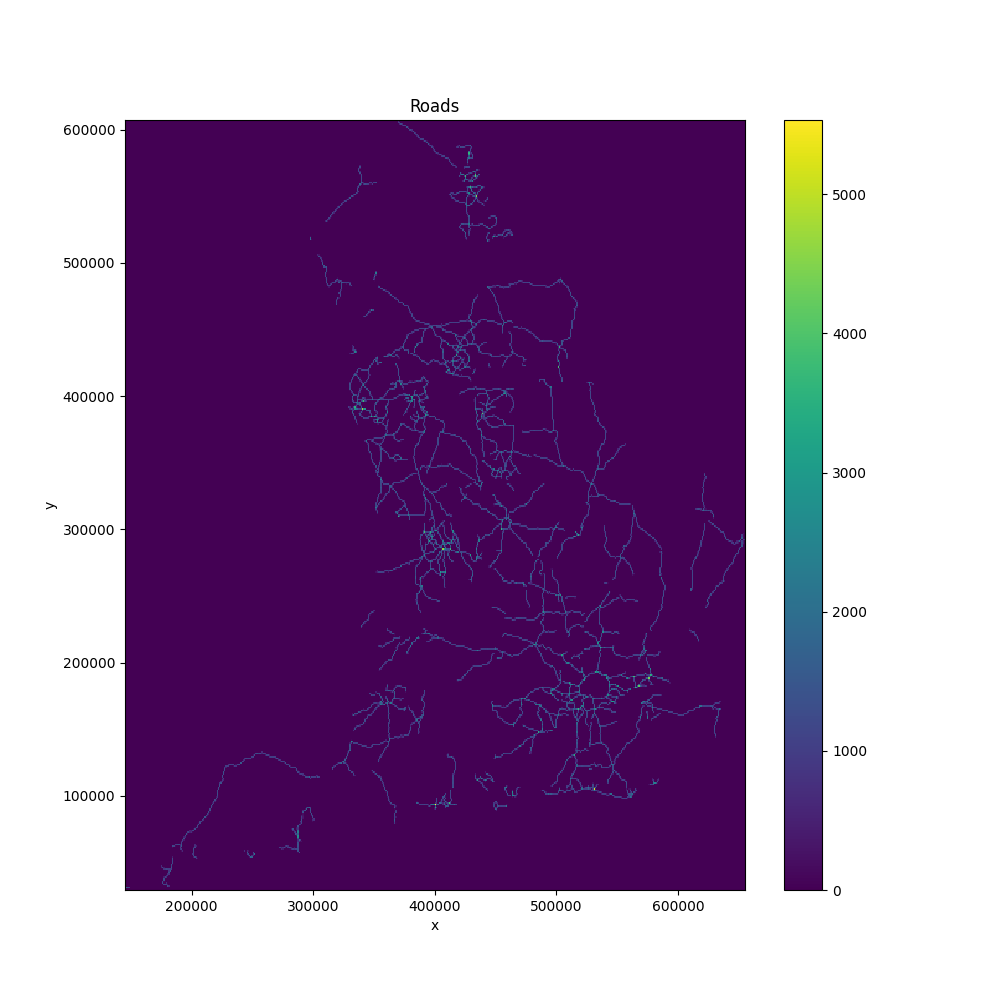
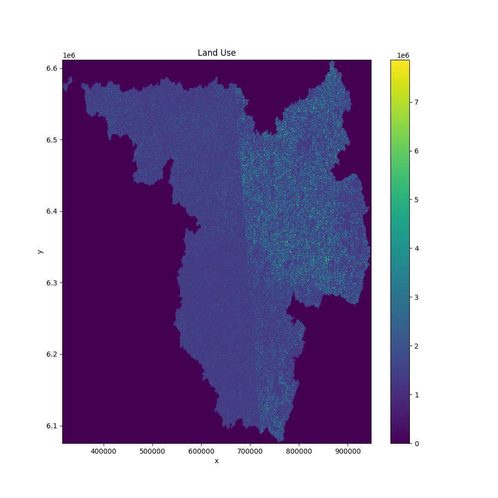

Usage
=====

Here is a basic example of how to use `rasterizer`:

.. code-block:: python

   import numpy as np
   import geopandas as gpd
   from shapely.geometry import LineString, Polygon
   from rasterizer import rasterize_lines, rasterize_polygons

   # 1. Define the output grid
   crs = "EPSG:32631"  # A metric CRS (UTM 31N)
   x_coords = np.arange(0.5, 100.5, 1.0)
   y_coords = np.arange(0.5, 100.5, 1.0)

   # 2. Create some line data
   line = LineString([(10, 10), (90, 90)])
   gdf_lines = gpd.GeoDataFrame([1], geometry=[line], crs=crs)

   # 3. Rasterize the lines
   # Get a raster where cell values represent the length of the line within them
   length_raster = rasterize_lines(gdf_lines, x=x_coords, y=y_coords, crs=crs)

   # Get a binary raster (True where cells are intersected)
   binary_raster_lines = rasterize_lines(gdf_lines, x=x_coords, y=y_coords, crs=crs, mode='binary')

   print("Length Raster:\n", length_raster)
   print("\nBinary Raster (Lines):\n", binary_raster_lines)

   # 4. Create some polygon data
   poly = Polygon([(20, 30), (80, 30), (80, 70), (20, 70)])
   gdf_polygons = gpd.GeoDataFrame([1], geometry=[poly], crs=crs)

   # 5. Rasterize the polygons
   # Get a raster where cell values represent the area of the polygon within them
   area_raster = rasterize_polygons(gdf_polygons, x=x_coords, y=y_coords, crs=crs)

   # Get a binary raster (True where cells are covered)
   binary_raster_polygons = rasterize_polygons(gdf_polygons, x=x_coords, y=y_coords, crs=crs, mode='binary')

   print("\nArea Raster:\n", area_raster)
   print("\nBinary Raster (Polygons):\n", binary_raster_polygons)

   # The result is an xarray.DataArray
   # You can plot it easily
   # length_raster.plot()
   # area_raster.plot()

Real World Examples
===================

Here are a couple of examples using real-world data.

Road Network
------------

This example uses a dataset of the major road network in Great Britain.

.. code-block:: python

   import geopandas as gpd
   import numpy as np
   import rasterizer
   import matplotlib.pyplot as plt
   import os
   import wget
   import zipfile

   def download_and_unzip(url, target_dir):
       """Downloads and unzips a file."""
       if not os.path.exists(target_dir):
           os.makedirs(target_dir)

       zip_path = os.path.join(target_dir, os.path.basename(url))

       if not os.path.exists(zip_path):
           print(f"Downloading {url}...")
           wget.download(url, out=zip_path)

       print(f"Unzipping {zip_path}...")
       with zipfile.ZipFile(zip_path, 'r') as zip_ref:
           zip_ref.extractall(target_dir)

   def main():
       # --- Data URLs ---
       roads_url = "https://maps.dft.gov.uk/major-road-network-shapefile/Major_Road_Network_2018_Open_Roads.zip"
       land_use_url = "https://download.data.public.lu/resources/corine-land-cover-2018/20200325-152907/corine-land-cover-2018-1872-classes-0.shp.zip"

       # --- Download and prepare data ---
       data_dir = "data"
       roads_dir = os.path.join(data_dir, "roads")
       land_use_dir = os.path.join(data_dir, "land_use")

       download_and_unzip(roads_url, roads_dir)
       download_and_unzip(land_use_url, land_use_dir)

       roads_shapefile = os.path.join(roads_dir, "Major_Road_Network_2018_Open_Roads.shp")
       land_use_shapefile = os.path.join(land_use_dir, "Corine_Land_Cover_2018_1872_Classes_0.shp")

       # Create _static directory if it doesn't exist
       if not os.path.exists("docs/_static"):
           os.makedirs("docs/_static")

       # Rasterize and plot roads
       roads = gpd.read_file(roads_shapefile)
       x_roads = np.linspace(roads.total_bounds[0], roads.total_bounds[2], 500)
       y_roads = np.linspace(roads.total_bounds[1], roads.total_bounds[3], 500)
       raster_roads = rasterizer.rasterize_lines(roads, x_roads, y_roads, crs=roads.crs)

       raster_roads.plot(figsize=(10, 10))
       plt.title("Roads")
       plt.savefig("docs/_static/roads_raster.png")
       plt.close()

Land Use
--------

This example uses the CORINE land cover dataset for Europe.

.. code-block:: python

       # Rasterize and plot land use
       land_use = gpd.read_file(land_use_shapefile)
       x_lu = np.linspace(land_use.total_bounds[0], land_use.total_bounds[2], 500)
       y_lu = np.linspace(land_use.total_bounds[1], land_use.total_bounds[3], 500)
       raster_lu = rasterizer.rasterize_polygons(land_use, x_lu, y_lu, crs=land_use.crs)

       raster_lu.plot(figsize=(10, 10))
       plt.title("Land Use")
       plt.savefig("docs/_static/land_use_raster.png")
       plt.close()

   if __name__ == "__main__":
       main()
